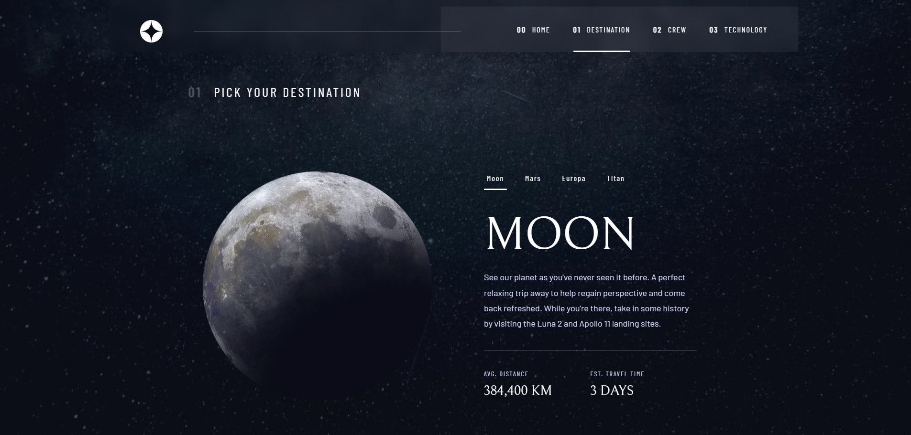
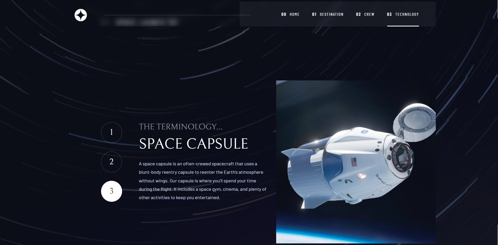

# Space tourism website solution

## Table of contents

- [Overview](#overview)
  - [The challenge](#the-challenge)
  - [Screenshot](#screenshot)
  - [Links](#links)
- [My process](#my-process)
  - [Built with](#built-with)
  - [What I learned](#what-i-learned)
  - [Continued development](#continued-development)
- [Author](#author)

## Overview

### The challenge

Users should be able to:

- View the optimal layout for each of the website's pages depending on their device's screen size
- See hover states for all interactive elements on the page
- View each page and be able to toggle between the tabs to see new information

### Screenshot

### Links

- Solution URL: [Add solution URL here](https://github.com/VitaliySaburdo/space-tourism-website)
- Live Site URL: [Add live site URL here](https://space-tourism-website-indol-five.vercel.app/)

## My process

### Built with

- [React](https://reactjs.org/) - JS library
- [React-router-dom](https://reactrouter.com/en/main)
- [Framer-motion](https://www.framer.com/motion/) - Framer Motion animation library
- SASS
- Flexbox
- Adaptive CSS (for 3 breakpoints mobile, tablet and desktop devices);
- Mobile-first workflow

### What I learned :muscle:

In this project, I learned how to work with Framer and also remembered how to work with background
images. Worked with Lighthouse website optimization. React(useState, useEffect, useRef,
useCallback). React-router-home

### Continued development :rocket:

In the next projects I will improve my JS; I also need to consolidate my knowledge of TypeScript.

## Author

- Telegram - [Link](https://t.me/Vitaliy_Saburdo)
- Linkedin - [Link](https://www.linkedin.com/in/vitaliy-saburdo-73363a264/?originalSubdomain=ua)
- Gmail - [Link](vsaburdo@gmail.com)
